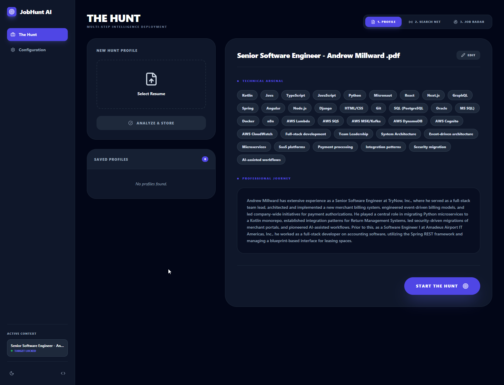
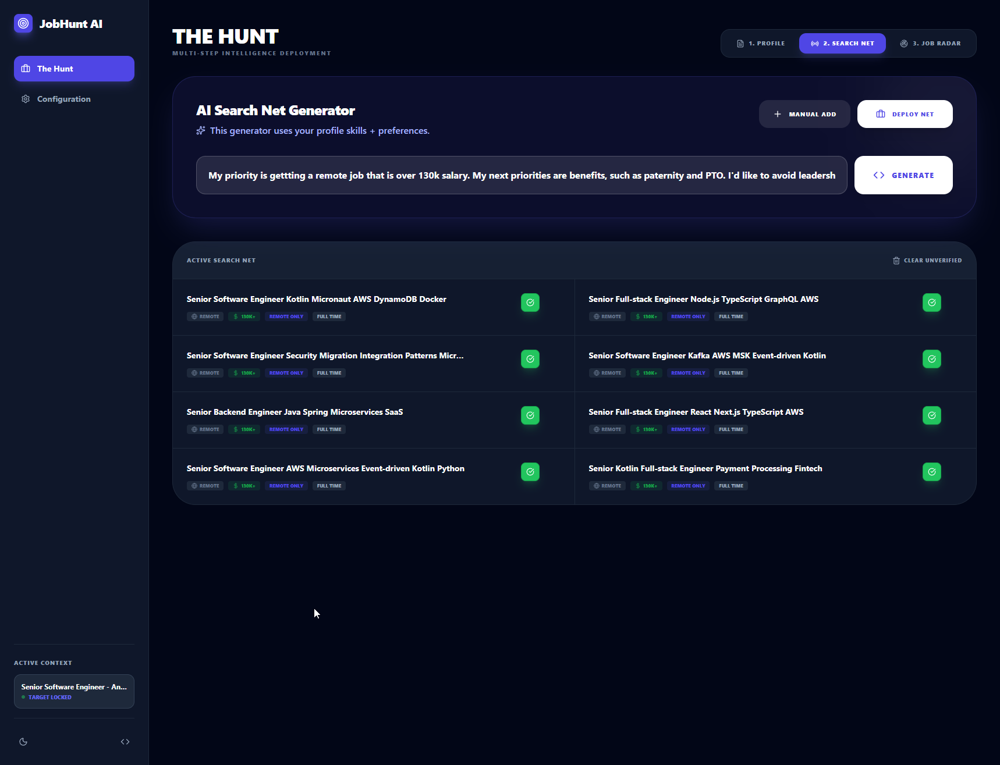
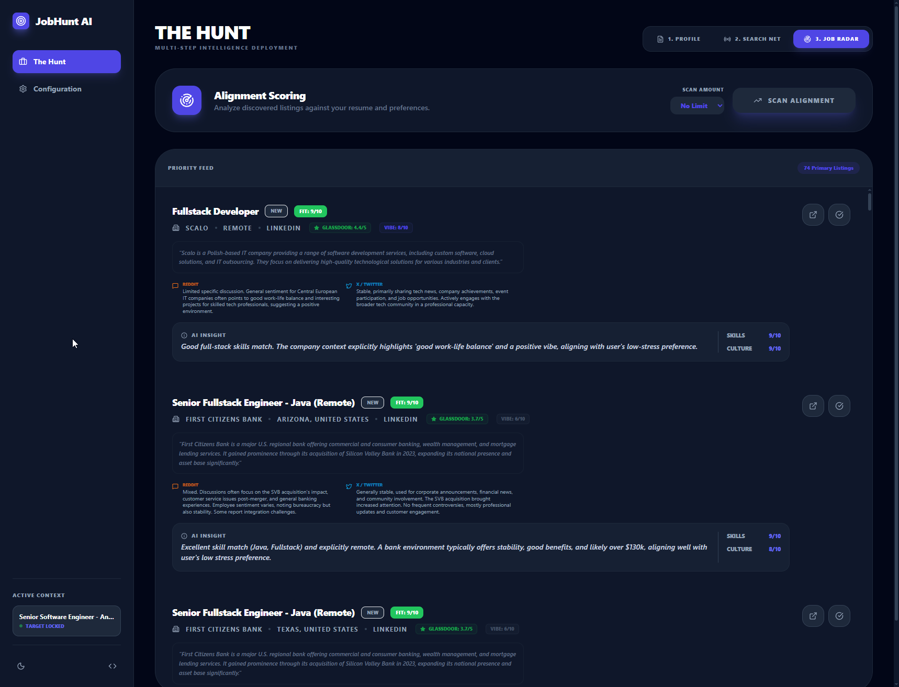

# 🤖 Job Hunt AI Agent

A state-of-the-art job search and application automation platform. It uses a **Python (FastAPI)** backend and a **React (TypeScript)** frontend to orchestrate AI-driven resume parsing, intelligent job discovery via a "Search Net," and deep company sentiment analysis.

## 📸 Platform Overview

### Resume Intelligence
Analyze your profile to extract structured skills and professional experience.


### Search Net Generation
AI-generated search meshes that optimize for volume and specificity.


### Job Radar
Live tracking of new opportunities across LinkedIn, Indeed, Glassdoor, and JSearch.


---

## 🛠 Prerequisites

Before starting, ensure you have the following installed:
- **[Node.js 20+](https://nodejs.org/)** (Frontend & Toolchain)
- **[Python 3.12+](https://www.python.org/downloads/)** (Backend Logic)
- **[Docker Desktop](https://www.docker.com/products/docker-desktop/)** (Required for PostgreSQL database)

### 🔑 AI & Search Intelligence
This project orchestrates multiple intelligence layers. You will need to configure at least **one** AI provider and **one** search source:

- **AI Engine (Choose at least one)**:
    - **[Google AI Studio (Gemini)](https://aistudio.google.com/app/apikey)**: Native support for long-context resume parsing.
    - **[OpenAI (GPT-4o)](https://platform.openai.com/api-keys)**: High-accuracy ranking and deduplication.
    - **[Ollama](https://ollama.com/)**: Run models locally (e.g., Llama 3) for privacy-conscious processing.
- **Search Sources**:
    - **[RapidAPI (JSearch)](https://rapidapi.com/jsearch-api-jsearch-api-default/api/jsearch)**: Provides deep access to job listings across the web. Get your key from the [RapidAPI Developer Dashboard](https://rapidapi.com/developer/dashboard).
    - **Open-Source Scrapers**: The system includes built-in support for **JobSpy** and **JobCatcher**, which require no API keys but can be toggled in the settings.

---

## 🚀 Getting Started

### 1. Database & Infrastructure
The system uses PostgreSQL for persistence. Spin it up using Docker:
```bash
docker-compose up -d db
```

### 2. Backend Setup (FastAPI)
Navigate to the `backend` directory, create a virtual environment, and install requirements:
```bash
cd backend
python -m venv .venv

# Activate (Windows)
.venv\Scripts\activate
# Activate (macOS/Linux)
source .venv/bin/activate

pip install -r requirements.txt
python run.py
```
*Note: The backend runs on `http://localhost:8000`.*

### 3. Frontend Setup (React)
Navigate to the `frontend` directory and install dependencies:
```bash
cd frontend
npm install
npm run dev
```
*Note: The UI will be available at `http://localhost:5173`.*

---

## ⚙️ Configuration & Hardware Toggles

Once the app is running, navigate to the **Configuration** tab. You can store your API keys directly in the UI for persistence in the database:

- **AI Credentials**: Input your `GEMINI_API_KEY` and `JSEARCH_API_KEY`. The UI will perform a **Health Check** to verify connectivity.
- **Provider Control**: Enable or disable specific search engines (**JobSpy**, **JobCatcher**, **JSearch**) to optimize your search runs or debug specific scrapers.
- **Model Selection**: Switch between **Cloud Intelligence** (Gemini/OpenAI) or your **Local Neural Engine** (Ollama).

---

## 🧠 Core Features

- **Automated Deduplication**: Incremental AI logic that groups identical job postings from different sites into a single primary candidate.
- **Company Intel**: Batched analysis of company sentiment via Reddit, Glassdoor, and X (Twitter) vibes.
- **Job Alignment Scoring**: A proprietary 1-10 scoring system that ranks jobs based on skill match and cultural alignment.
- **Verified Search Net**: A collection of AI-optimized queries that you can verify before deploying into the "wild."
